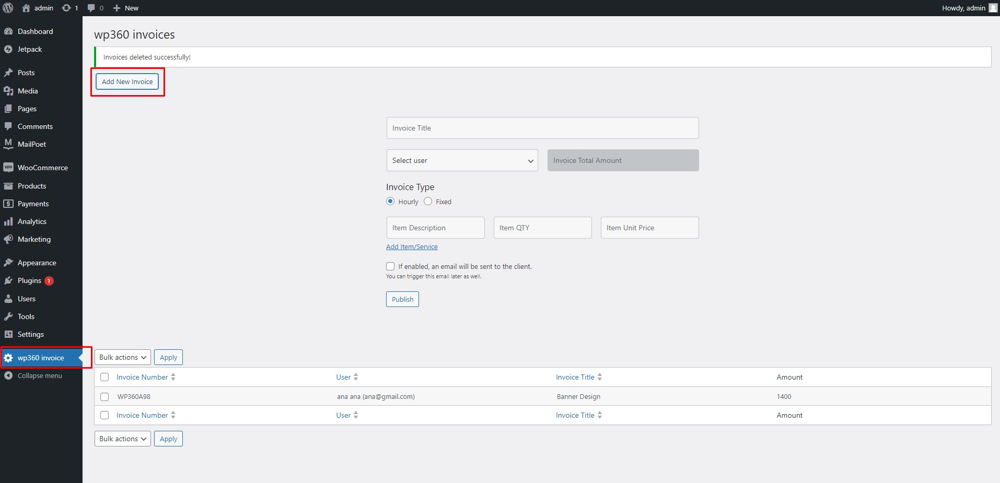
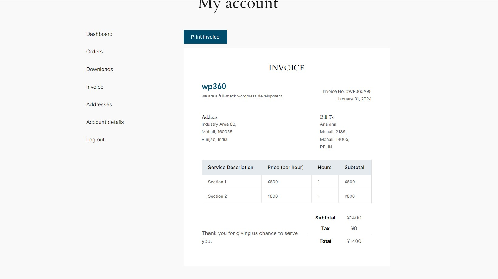

=== WP360 Invoice ===

Contributors: wp360
Donate link: https://wp360.in
Tags: woocommerce, invoice, custom invoice
Requires at least: 5.2.0
Tested up to: 6.3
Stable tag: 1.0.0
Requires PHP: 7.0
License: GPLv2 or later
License URI: https://www.gnu.org/licenses/gpl-2.0.html

The WP360 Invoice Plugin provides an intuitive solution to manage and create invoices seamlessly for WooCommerce websites. .

== Description ==
The WP360 Invoice Plugin simplifies invoice management for WooCommerce websites with a user-friendly interface, centralized admin control, and client access to view and print their invoices.

== Features ==

- Simple and intuitive interface for creating custom invoices.
- Centralized management of all invoices in the WordPress admin area.
- User-friendly access for clients to view their invoices within their dashboard under the Invoice menu.

== Logo and Tagline ==

The plugin dynamically retrieves the logo and tagline from your WordPress settings for the invoice template. On the invoice template, the logo and tagline are sourced from the WordPress settings.

== Installation ==

1. Upload the `wp360-invoice` directory to the `/wp-content/plugins/` directory.
2. Activate the plugin through the 'Plugins' menu in WordPress.
3. Configure the plugin settings via the 'wp360 Invoice' menu in the WordPress admin.

== Usage ==

1. Once activated, a new 'wp360' menu will appear in the WordPress admin.
2. Create custom invoices by utilizing the 'Add Invoice' form within the 'wp360 Invoice' menu.
3. Efficiently manage and review invoices in the WordPress admin area.
4. Users can access their invoices through their my account dashboard under the 'Invoice' menu.

== Changelog ==
= 1.0.0 =

- Initial release.

== Frequently Asked Questions ==

= Is this plugin compatible with other websites?

Yes, this plugin is designed to be compatible with all WooCommerce websites. Feel free to use it on other WooCommerce sites without concerns about compatibility issues or security vulnerabilities.

= How do I create a new invoice?

1. Navigate to the 'wp360 Invoice' menu in the WordPress admin.
2. Click 'Add Invoice' and complete the necessary details in the form.
3. Press 'Publish' to generate the invoice.

= Where can users view their invoices?

Users can conveniently view and manage their invoices in their dashboard under the 'Invoice' menu.

== Screenshots ==

1. This screen shot description corresponds to screenshot-1.(png|jpg|jpeg|gif). Screenshots are stored in the /screenshots directory.
2. This is the second screen shot

*Add Invoice form in the WordPress admin.*

*List of invoices in the WordPress admin.*

*Invoice menu in the user's dashboard.*

== Upgrade Notice ==

= 1.1.0

Initial release of the WP360 Invoice Plugin.

Blockquotes are email style:

> Asterisks for *emphasis*. Double it up  for **strong**.

And Backticks for code:

`<?php code(); ?>`
